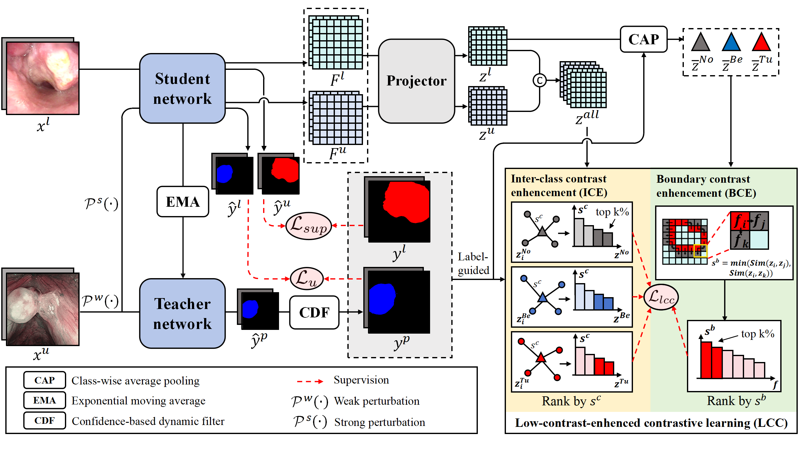

# LoCo
Official PyTorch implementation of LoCo: Low-Contrast-Enhanced Contrastive Learning for Semi-Supervised Endoscopic Image Segmentation.

## Overview
<p align="center">
    
</p>


## Usage
### Installation
```sh
cd LoCo
conda create -n LoCo python=3.9
conda activate LoCo
pip install torch==2.0.1+cu118 torchvision==0.15.2+cu118 --index-url https://download.pytorch.org/whl/cu118
pip install -r requirements.txt
```
### Download the backbone
[ResNet50](https://drive.google.com/file/d/1mqUrqFvTQ0k5QEotk4oiOFyP6B9dVZXS/view?usp=sharing)
```sh
├── ./pretrained
    ├── resnet50.pth
```

### How to run
Use the following command to train the model. Here, \<num_gpu\> specifies the number of GPUs to use, and \<port\> refers to the port number used for training.
```sh
sh ./scripts/train.sh <num_gpu> <port>
```


